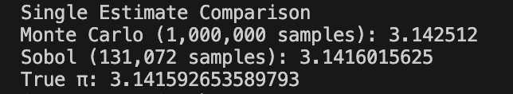
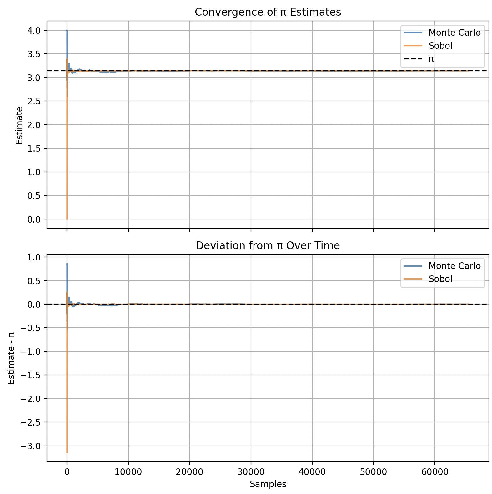
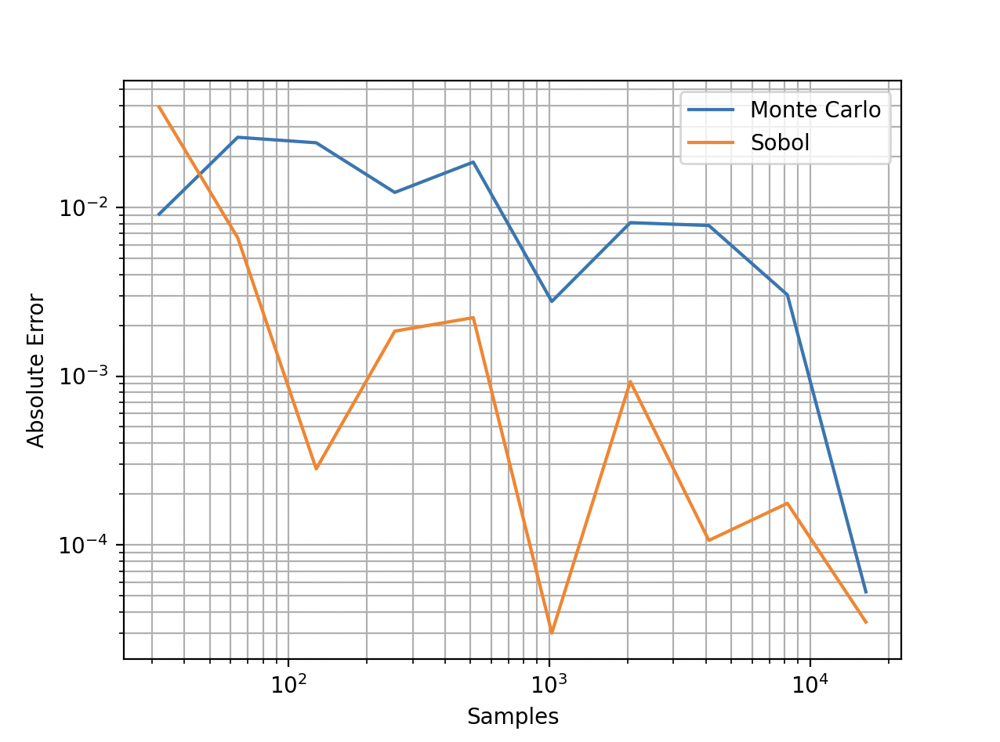

# Monte Carlo and Quasi–Monte Carlo Estimation of π

A Python project exploring Monte Carlo (MC) and Quasi–Monte Carlo (QMC) methods through the classical problem of estimating π.

This focuses on convergence behavior, error analysis, and deterministic vs stochastic sampling with visualizations.

## Project Overview

The core idea is simple:

> Uniformly sample points in the unit square $[0,1]^2$. and estimate π from the fraction that fall inside a quarter circle.

Estimation is analyzed using:

- Streaming convergence analysis
- Error‑space visualization
- Comparison of pseudo‑random and low‑discrepancy sampling

## Mathematical Foundation

Let `(x, y)` be sampled uniformly from the unit square `[0, 1] × [0, 1]`.

Define the indicator function:

```text
I(x, y) = 1   if x² + y² ≤ 1
          0   otherwise
```

The expected value of this indicator is the probability that a random point lies inside the quarter circle:

```text
E[I] = (area of quarter circle) / (area of square)
     =  π / 4
```

By the Law of Large Numbers, the sample mean converges to the expectation, giving the estimator:

```text
π ≈ 4 · (1/N) · Σ I(xᵢ, yᵢ)
```

## Methods Implemented

### 1. Standard Monte Carlo (Pseudo‑Random)

- NumPy random number generator
- Unbiased estimator
- Convergence rate: $O(N^{-1/2})$
- High variance, visible noise in convergence plots

### 2. Streaming Monte Carlo

- Online estimate after every sample
- Used to visualize convergence behavior over time
- Highlights variance‑dominated error

### 3. Quasi–Monte Carlo (Sobol Sequences)

- Low‑discrepancy, deterministic point sets
- Often exhibits near $O(N^{-1})$ convergence for integration
- Scrambling enabled
- Sample sizes chosen as powers of two to preserve balance properties

### 4. Streaming Sobol Estimation

- Enables direct comparison with Monte Carlo in convergence plots
- Demonstrates reduced variance and smoother convergence

## Visualizations

### Convergence Plots

Each convergence run produces two synchronized plots:

1. Raw estimates of π
   - Shows overall convergence
   - Provides intuition

2. Deviation from π ($\hat{\pi}_N - \pi$)
   - Makes small differences visible
   - Clearly shows variance vs low‑discrepancy behavior

## Project Structure

```text
MonteCarlo-Pi/
│
├── estimators.py      # Monte Carlo estimators (batch + streaming)
├── sequences.py       # Sobol utilities (batch + streaming)
├── analysis.py        # Error and variance analysis
├── visualization.py   # Convergence and error plots
│
├── main.py                # Project entry point
├── README.md
└── requirements.txt       # Project dependencies
```

## Running the Project

Install dependencies:

```bash
pip install -r requirements.txt
```

From the project root:

```bash
python main.py
```

This will:

1. Compute single MC and Sobol estimates
2. Plot streaming convergence (MC vs Sobol)
3. Plot error vs sample size

## Example Usage

```python
from estimators import estimate_pi_mc
from sequences import estimate_pi_sobol

pi_mc = estimate_pi_mc(1_000_000)
pi_sobol = estimate_pi_sobol(2**13)
```

## Screenshots




